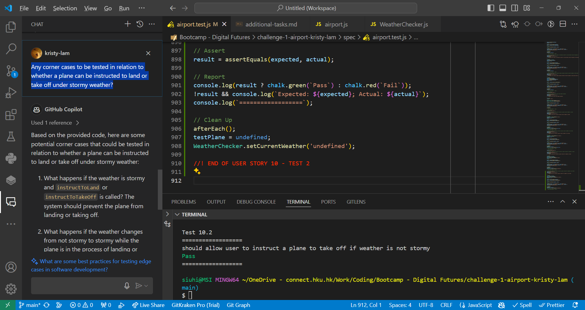

# Evidence of Using Copilot

- Asking Copilot to suggest edge cases for User Story 9: As an air traffic controller, I want the system to not allow me to instruct a plane to land when the weather is stormy, so that the plane will not land in a dangerous situation.

- Asking Copilot to suggest corner cases in relation to landing or taking off under stormy weather

*See question highlighted*

*Points 3 to 5 are relevant answers to the weather issue (others are relevant to the functionality of the whole programme in general)*

