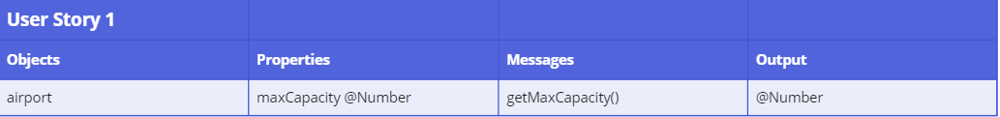
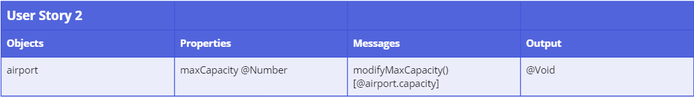
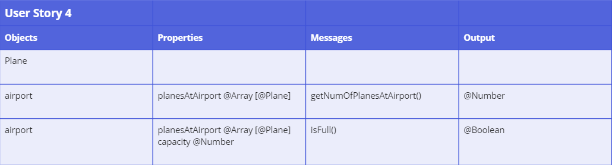
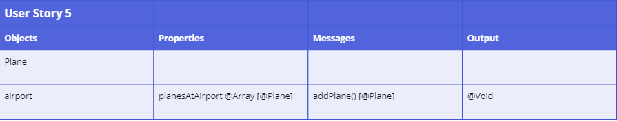
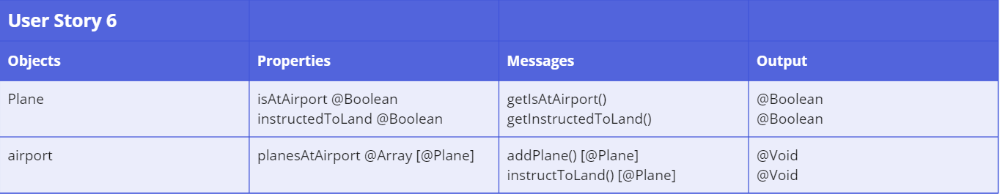
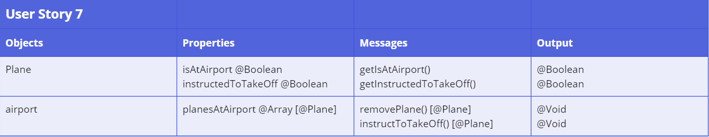
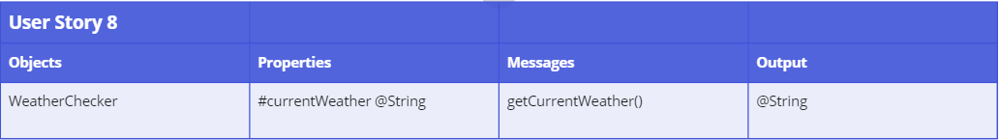
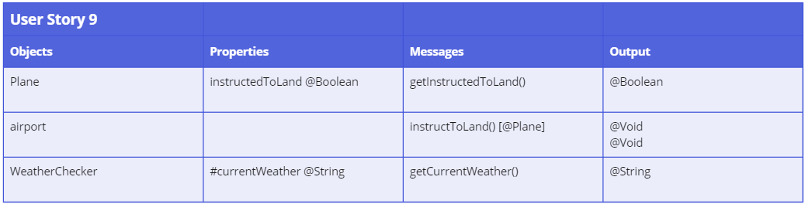
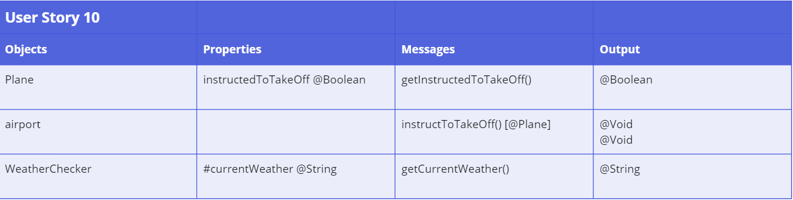

# Domain Models and Test Plan

In light of the client's requirements, seven user stories have been identified. To accomplish the goals in the user stories, tests have been designed and conducted to ensure that the production code would deliver the desired outcome. Please see below the user stories listed in bullet points, the domain models created for the stories to describe how the objects use messages to communicate with one another, and the associated tests for the stories. The link to the miro board containing a Kanban board tracking the work progress is also provided [here](https://miro.com/app/board/uXjVKSab-T8=/?moveToWidget=3458764586273634861&cot=14).

## User Stories, Domain Models and Tests

**1. As an air traffic director, I want to have a representation of the airport's maximum capacity of the number of planes that can be at the airport in the software, so that I can ensure safety at the airport.**

| No.      | Test                                           |
| -------- | ---------------------------------------------- |
| Test 1.1 | Test that capacity can be modified accordingly |

**2. As an air traffic director, I want to be able to modify the capacity as appropriate, so that it can be changed in response to different scenarios, e.g. closure of runway.**

| No.      | Test                                                          |
| -------- | ------------------------------------------------------------- |
| Test 2.1 | Test that capacity can be modified accordingly                |
| Test 2.2 | Test that only a number can only be used as capacity          |
| Test 2.3 | Test that only a positive number can only be used as capacity |

**3. As an air traffic controller, I want to be able to check whether a plane is at the airport, so that I will know whether I need to instruct the plane regarding whether it can land at the airport.

| No.      | Test                                                            |
| -------- | --------------------------------------------------------------- |
| Test 3.1 | Test that there is a property of isAtAirport for a plane object |
| Test 3.2 | Test that user can get the isAtAirport property of a plane      |

**4. As an air traffic controller, I want to be able to check whether the airport is full, so that I will know whether I can instruct a plane which is not already at the airport can land.**

| No.      | Test                                                                                                    |
| -------- | ------------------------------------------------------------------------------------------------------- |
| Test 4.1 | Test the getNumOfPlanesAtAirport function correctly shows the number of planes currently at the airport |
| Test 4.2 | Test the isFull function is correct when the airport is empty                                           |
| Test 4.3 | Test the isFull function is correct when there is a plane at the airport                                |
| Test 4.4 | Test the isFull function is correct when the airport is full                                            |

**5. As an air traffic controller, I want the system to update the planes at the airport after a plane has landed, so that the number of planes currently at the airport will be updated accurately.**

| No.      | Test                                                                                                          |
| -------- | ------------------------------------------------------------------------------------------------------------- |
| Test 5.1 | Test when a plane is added, that plane is in the planesAtAirport array                                        |
| Test 5.2 | Test that a plane which is not an instance of the Plane class cannot be added to the planesAtAirport array    |
| Test 5.3 | Test that the same plane cannot be added to the planesAtAirport array again when it is already at the airport |

**6. As an air traffic controller, I want to be able to instruct a plane which is not at the airport to land if the airport is not full, so that the plane can land.**

| No.      | Test                                                                                                               |
| -------- | ------------------------------------------------------------------------------------------------------------------ |
| Test 6.1 | Test that a plane which is already at the airport cannot be instructed to land                                     |
| Test 6.2 | Test that when a plane has landed at the airport, its isAtAirport property is changed to true                      |
| Test 6.3 | Test that a plane cannot be added to the airport when is full                                                      |
| Test 6.4 | Test that a plane cannot be instructed to land when the airport is full                                            |
| Test 6.5 | Test that after a plane has been instructed to land, the instructed to land property of that plane changes to true |
| Test 6.6 | Test that after a plane has landed, the instructed to land property of that plane returns to null                  |

**7. As an air traffic controller, I want to be able to instruct a plane which is at the airport to take off, so that the plane can leave.**

| No.      | Test                                                                                                                |
| -------- | ------------------------------------------------------------------------------------------------------------------- |
| Test 7.1 | Test when a plane is removed, that plane is removed from the planesAtAirport array                                  |
| Test 7.2 | Test that when a plane has landed at the airport, its isAtAirport property is changed to true                       |
| Test 7.3 | Test that a plane which is not at the airport cannot be instructed to take off                                      |
| Test 7.4 | Test that when a plane is instructed to take off, the instructed to take off property of that plane changes to true |
| Test 7.5 | Test that when a plane has taken off, the instructed to take off property of that plane returns to null             |

1. As an air traffic controller, I want to be able to check the current weather, so that I will know whether I should instruct a plane to land or take off.

| No.      | Test                                            |
| -------- | ----------------------------------------------- |
| Test 8.1 | should be able to get current weather condition |

9.  As an air traffic controller, I want the system to not allow me to instruct a plane to land when the weather is stormy, so that the plane will not land in a dangerous situation.

| No.      | Test                                                                      |
| -------- | ------------------------------------------------------------------------- |
| Test 9.1 | should not allow user to instruct a plane to land if weather is stormy    |
| Test 9.2 | should allow user to instruct a plane to land if weather is not stormy    |
| Test 9.3 | should not allow user to instruct a plane to land if weather is undefined |

10. As an air traffic controller, I want the system to not allow me to instruct a plane to take off when the weather is stormy, so that the plane will not take off in a dangerous situation.

| No.       | Test                                                                          |
| --------- | ----------------------------------------------------------------------------- |
| Test 10.1 | should not allow user to instruct a plane to take off if weather is stormy    |
| Test 10.2 | should allow user to instruct a plane to take off if weather is not stormy    |
| Test 10.3 | should not allow user to instruct a plane to take off if weather is undefined |
